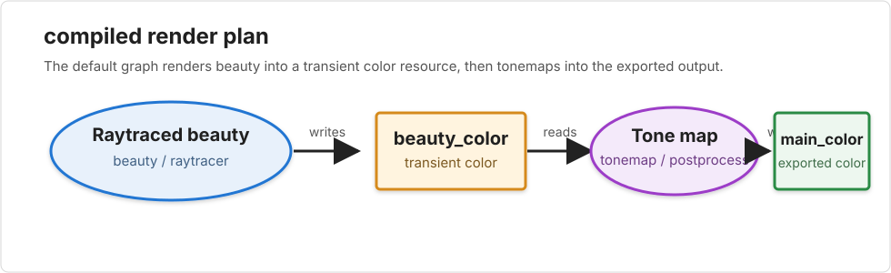

# Render plans and resources

A renderer usually starts as one function that fills one image. That is easy to
understand, but it hides the intermediate images and decisions that make a
frame. The render graph layer exposes those intermediate products as named
resources and exposes the work as named pass declarations.

In this codebase, the graph layer is centered on
[`RenderPlan`](../../../include/engine/graph/RenderPlan.h). A plan is a
deterministic list of resource descriptors plus a deterministic list of pass
nodes. It can be validated, exported as text, exported as DOT, exported as
JSON, and copied with user-specified disable overrides.

## <a id="the-vocabulary-lives-in-one-place"></a>The vocabulary lives in one place
[`RenderGraphTypes.h`](../../../include/engine/graph/RenderGraphTypes.h)
contains the shared data types used by the graph module. The small type aliases
make ids explicit:

```cpp
using RenderPassId = std::string;
using RenderResourceId = std::string;
using RenderFeatureKind = std::string;
```

A pass id names a unit of work, a resource id names a produced or consumed data
product, and a feature kind gives users a higher-level switch such as
`"shadow_maps"` or `"main"`. Pass code queries those tags through
`RenderPassNode::hasFeature()` and `RenderPassNode::hasAnyFeature()` rather
than searching the feature vector directly; plan-level callers can also ask
`RenderPlan::passesWithFeature()` and `RenderPlan::resourcesWithFeature()` for
the tagged subset, or use `passesWithAllFeatures()` and
`resourcesWithAllFeatures()` when a later planner needs a precise intersection
such as "the color output for this subview."

The same header defines the enum classes used by plan declarations:

- `RenderExecutorPreference` names a user's broad engine preference:
  raytracer, pathtracer, wavefront, rasterizer, or wireframe.
- `RenderExecutorKind` names the executor required by a compiled pass:
  raytracer, wavefront, rasterizer, wireframe, composite, or postprocess.
- `RenderPassKind` groups passes as beauty, shadow, overlay, composite,
  tonemap, postprocess, readback, visibility, AOV, debug, or custom.
- `RenderResourceType` classifies image-like graph products such as color,
  depth, stencil, object id, material id, normals, world positions, motion
  vectors, shadow maps, shadow masks, visibility sets, and custom textures.

Each enum has a `toString(...)` helper implemented next to the type
definitions in
[`RenderGraphTypes.cpp`](../../../src/engine/graph/RenderGraphTypes.cpp).
Exports use those helpers, so text, DOT, and JSON dumps use the same spelling.

## <a id="intent-describes-what-the-user-asked-for"></a>Intent describes what the user asked for
`RenderIntent` is the user-facing request. It says what executor and view mode
the frame should use by default, names the default shading profile, optionally
names a default camera, and stores per-selection overrides.

Scene selections use `SceneSelector`:

```cpp
struct SceneSelector {
  enum class Kind {
    All,
    ObjectId,
    ObjectName,
    Tag,
    Layer,
    MaterialRole
  };

  Kind kind{Kind::All};
  std::string value;
};
```

That gives the graph layer a stable way to say "all objects", "this object",
"this layer", or "objects with this material role" without tying the core plan
model to Qt widgets or JSON parsing.

`RenderViewOverride` combines a selector with optional replacements for
executor, view mode, shading profile, camera, and engine options. The result is
a layered request: one default frame intent plus targeted overrides for
specific parts of the scene.
Whole-frame overrides whose selector is `all` are applied to the default frame
intent before compilation. More specific selector overrides remain intent for
future scene-partitioning planners; current graph compilation rejects them with
a clear error instead of silently rendering only the default frame intent. Users
still describe what they want, and the compiler remains responsible for
synthesizing pass nodes.
Advanced controls such as raytracer sampler, samples per pixel, recursion
depth, raster MSAA, raster LOD, raster visibility culling, raster shadow-map
quality, and wireframe LOD live in typed `RenderEngineOptions` fields on the
intent. The compiler resolves those options into typed pass state or
intent-derived graph nodes; rendercli and the raster render dialog no longer
compile a plan and then patch pass parameters in a separate front-end step.
Render-to-texture subviews can either inherit the global engine options or
carry their own override block, so low-resolution probes and high-quality final
views can share one intent model without users requesting graph nodes directly.
The compiler now expands whole-scene subviews into prefixed offscreen color
branches that are visible in graph exports and the Modeler graph view. Raster
subviews also export a matching prefixed depth AOV resource so later portal or
mirror composites can depend on both color and depth. Subview branches add a
stable `subview:<id>` feature to every prefixed pass/resource, and exported
subview final color/depth outputs add `subview_output` plus
`subview_color_output` or `subview_depth_output` for later consumers that need
to find the sampled resources without parsing ids. When a raster subview
selects the OpenGL backend, the compiled branch still exposes the GPU-to-CPU
readback passes
before tonemap or exported AOV publication, making the transfer boundary
inspectable instead of hidden inside execution. Selector-specific subviews are
still rejected explicitly until scene partitioning can honor those selectors
during execution. The intent also carries
`maxRenderToTextureRecursionDepth`, which defaults to one subview level and can
be set to zero to reject render-to-texture expansion entirely.
When the effective frame intent names a default camera or non-default shading
profile, synthesized scene-rendering passes carry those references in their
`SceneView` and in exported plan JSON. Shading-profile parameters are parsed
into scalar graph values at the JSON boundary, so compiled intent is no longer
holding raw JSON for that field. Text and DOT plan exports also show scene
selector, camera, and shading-profile details when those details affect a pass,
so command-line inspections expose the same scene-view intent that the Modeler
graph inspector shows in its pass details.

Scene JSON can carry a top-level `renderIntent` object. `RenderIntent::toJson()`
and `RenderIntent::fromJson(...)` own that serialization. `world::Scene` keeps
the block optional: scenes without one use the default raytraced beauty intent,
while scenes with one preserve the requested executor, view mode, shading
profile, feature toggles, raster postprocess AA request, engine options,
requested exported AOVs, camera reference, subview intents, and per-selector
overrides. Tools then layer temporary choices over that saved intent through
`RenderGraphRequest` instead of directly authoring low-level pass nodes or
mutating the scene's durable intent.
When no default camera is named, tools derive a scene-camera reference from the
active editable-scene camera so the compiled graph still explains which camera
feeds scene-rendering passes.
The compiler also receives scene-derived analysis through
`RenderSceneAnalysis`. Intent says what result the user wants; analysis says
what the current scene snapshot contains. `world::Scene::renderGraphAnalysis()`
collects those facts through the element hierarchy, such as visible surfaces
and lights, before the scene is converted into the runtime `render::Scene`.
That keeps graph synthesis scene-aware without asking users to author graph
nodes directly. For example, a raster preview-shadow intent only compiles a
`raster_preview_shadows` node when the analyzed scene has visible geometry and
lights; direct compiler callers that do not provide analysis keep conservative
feature expansion.
For example, rendercli uses the scene intent as the graph compiler input, but
`--render_graph_executor`, `--render_graph_view`, `--render_graph_aov_out`,
`--render_graph_wireframe_overlay`, and `--post_aa` can still override the
effective command-line render.
The Modeler preview uses the same request resolver for its engine menu, view
menu, postprocess AA selector, shadow toggle, and overlay toggle, so selecting
"None" for AA or clearing a preview feature is a real front-end override rather
than a separate Modeler-only interpretation of scene intent.
Because whole-frame overrides become the effective frame intent before pass
synthesis, tool-level state such as raster MSAA and preview shadow settings is
attached to the synthesized raster passes after those overrides are applied.

## <a id="resources-are-descriptors-not-buffers"></a>Resources are descriptors, not buffers
A render resource is declared with `RenderResourceDescriptor`:

```cpp
struct RenderResourceDescriptor {
  RenderResourceId id;
  std::string name;
  std::vector<RenderFeatureKind> features;
  RenderResourceType type{RenderResourceType::Color};
  RenderResourceFormat format{RenderResourceFormat::Unknown};
  int width{0};
  int height{0};
  int sampleCount{1};
  RenderResourceDomain domain{RenderResourceDomain::CPU};
  RenderResourceLifetime lifetime{RenderResourceLifetime::Transient};
};
```

The descriptor records what the resource is. It does not own the memory behind
that resource. That separation is important: a plan can be printed, validated,
or displayed without allocating every image it mentions.
Resource `features` are non-executing annotations for tooling. For example, the
compiler tags the raster visibility resource with visibility, culling, and
rasterizer features so text, DOT, JSON, and the Modeler resource table make its
purpose clear before the graph runs.

Resource domains are `CPU` and `GPU`. `CPU` resources can be allocated by
`RenderResourceStorage`; `GPU` resources are descriptors without CPU buffers in
that storage object. Current executors are CPU-backed, so validation rejects a
pass that reads or writes a `GPU` resource until a GPU-capable executor is
introduced. Resource lifetimes are:

- `Transient` -- produced inside the plan and consumed by other passes.
- `Imported` -- available before the plan starts.
- `Exported` -- a result the caller can take after the plan.
- `History` -- a carried-over resource from an earlier frame.
- `PersistentCache` -- a retained cache resource.

Validation treats imported, history, and persistent-cache resources as
externally available. A transient or exported resource that is read must have a
producer in the plan, and every exported resource must have a declared producer
even when no other pass reads it. Imported and history resources are still
execution inputs: `GraphRenderEngine::setExternalColorResource(...)` and
`setExternalDepthResource(...)` / `setExternalObjectIdResource(...)` can bind
CPU color, depth, and integer-id inputs for the current execution slice, and
the engine rejects plans that read unbound or unsupported external inputs.

Persistent cache resources have a separate execution-time home:
[`RenderGraphArtifactCache`](../../../include/engine/graph/RenderGraphArtifactCache.h).
Graph engines and their render-thread clones share one cache instance. Entries
are immutable artifacts addressed by a typed key: producer pass id, resource
descriptor, pass-state fingerprint, and render-input fingerprint. The cache is
ready for shadow maps, reflection probes, and similar resources once those
artifacts are represented outside the direct engines.

Readback is modeled as an explicit graph pass kind rather than hidden final
state. The first `readback` payload copies CPU-materialized resources through
the resource instances themselves and reports a clear error for descriptor-only
GPU resources. That gives future OpenGL/Vulkan resource subclasses one
execution hook for GPU-to-CPU transfer while keeping dependencies visible in
text, DOT, JSON, and the Modeler graph view.

## <a id="pass-nodes-declare-reads-and-writes"></a>Pass nodes declare reads and writes
`RenderPassNode` is the declarative node in the graph:

```cpp
struct RenderPassNode {
  RenderPassId id;
  std::string name;
  RenderPassKind kind{RenderPassKind::Custom};
  RenderExecutorKind executor{RenderExecutorKind::PostProcess};
  std::vector<RenderFeatureKind> features;
  std::vector<ResourceRead> reads;
  std::vector<ResourceWrite> writes;
  SceneView sceneView;
  std::shared_ptr<const RenderPassState> state;
  DisabledBehavior disabledBehavior{DisabledBehavior::Error};
  bool enabled{true};
  bool hasExternalSideEffects{false};
  bool canRunConcurrently{true};
};
```

The central fields are `reads` and `writes`. A tonemap pass, for example, can
read `main_color` and write `display_color`. A shadow pass can write
`shadow_mask`, and a beauty pass can read that mask before writing
`main_color`. `RenderPlan` owns the common dependency queries around those
edges: callers can look up a pass or resource by id, ask which pass produces a
resource, and list the passes that consume a resource without duplicating
linear scans in every inspection or rewrite tool.

Plan construction uses the same resource-edge model. `RenderPlan` can connect a
producer pass to an existing consumer through a newly declared resource, and it
can route an existing resource through an inserted filter pass while redirecting
later consumers to the filter output. The compiler uses those plan-owned
operations for optional shadow, postprocess AA, and overlay passes, so
dependencies are authored as graph edges rather than as loose pass-list
append operations.

`state` carries typed pass-payload state. Generic graph validation still
reasons about resources and dependencies, while the matching payload owns how
those settings configure the executor. JSON import/export serializes this
typed state through a pass's `parameters` object, but graph execution does not
carry an uninterpreted JSON object. Raster beauty passes use focused state
objects for sampling, framebuffer, geometry, execution, and shadow-map
controls. Wireframe beauty and overlay passes carry their own typed state for
wireframe-specific controls such as LOD. Image-space anti-aliasing postprocess
passes use a typed `post_process_aa` state object so replayed JSON chooses FXAA
or SMAA before execution reaches the payload.

The node also carries a `DisabledBehavior` value:

- `Error` means the pass is required.
- `CullDependents` names a pass whose consumers cannot use its outputs when it
  is disabled.
- `SubstituteDefault` means the pass still satisfies consumers by substituting
  a default output.
- `Passthrough` records pass-through disable intent for the node.

When overrides disable a `CullDependents` pass, `RenderPlan::withOverrides`
also disables every pass that consumes its outputs, then repeats that operation
for consumers of the newly disabled passes. The resulting effective plan is
what rendercli and the Modeler inspector validate and display.

Validation gives producer semantics to `SubstituteDefault`: a disabled producer
with that behavior can still satisfy consumers. A disabled producer with any
other behavior triggers `DisabledDependency` when another enabled pass reads
its output. `Passthrough` is validated more strictly because the disabled pass
still runs a copy operation: it must have one input and at least one
shape-compatible output.

The current executor is serial, but it is not list-driven. Before execution,
`GraphRenderEngine` asks the plan for a dependency order derived from resource
producer/consumer edges. A replayed JSON plan can declare `tonemap` before
`beauty`, for example, as long as `beauty` writes the resource that `tonemap`
reads. Validation still catches missing producers, disabled producers that
cannot substitute output, duplicate writers, and dependency cycles.
Tools can inspect declared pass-to-pass edges through
`RenderPlan::dependencies()`. When a tool is focused on one selected node,
`RenderPlan::dependenciesInto(passId)` and
`RenderPlan::dependenciesOutOf(passId)` provide the same edge records filtered
to that pass.

The pass declaration is separate from execution code. Executor-specific work
lives behind
[`RenderPassPayload`](../../../include/engine/graph/RenderPassPayload.h), whose
interface is a virtual `execute(RenderExecutionContext&)` method. The node
describes the graph; the payload performs the pass.

`RenderExecutionContext` supplies the payload with the current node, frame-local
resource storage, the owning graph engine's render settings, cancellation
state, and the active child-engine hook used for progress reporting. The
built-in payloads currently cover whole-frame raytracer, rasterizer, and
wireframe beauty passes plus tonemap and image anti-aliasing postprocess
passes.

Payloads may also expose a display-buffer fast path. When the effective graph
is a whole-frame raytracer beauty pass followed by downstream color passes, the
graph engine can ask the beauty payload to render into both the HDR graph
resource and the packed RGB display buffer. That preserves progressive preview
behavior: a GUI polling the display buffer sees pixels as the raytracer finishes
tiles, and later postprocess passes publish their filtered output without
hiding the declarative graph from the user.

## <a id="validation-catches-graph-mistakes"></a>Validation catches graph mistakes
`RenderPlan::validate()` walks the resource list and pass list and returns a
`RenderPlanValidation`. Each issue is a `RenderPlanValidationError` with a
machine-readable code, a human-readable message, and the relevant pass/resource
ids.

Validation checks:

- empty pass ids and resource ids,
- duplicate pass ids and resource ids,
- reads or writes of unknown resources,
- multiple passes writing the same resource,
- reads of transient/exported resources that have no producer,
- exported resources that have no declared producer,
- passes reading or writing resources in a domain their executor cannot handle,
- disabled required passes,
- reads from disabled producers that do not substitute a default output,
- negative dimensions or non-positive sample counts,
- dependency cycles.

The dependency graph comes from resource flow. If pass A writes a resource
that pass B reads, B depends on A. A cycle exists when the dependency walk can
return to a pass already on the active stack. A single pass reading and writing
the same resource is also reported as a cycle.

The same dependency walk exposes execution stages: each stage is the set of
passes whose producer dependencies are already satisfied by earlier stages.
The current `GraphRenderEngine` still executes serially, but text, DOT, and
JSON exports plus the Modeler graph layout use these stages to make independent
AOV or cache branches appear as parallel candidates rather than a misleading
list. DOT exports also group pass nodes by execution stage with rank hints,
include stage/order labels on each pass, and show resource format/lifetime
labels on resource nodes.
Code that needs to annotate individual pass rows can ask the plan for a pass's
stage number directly instead of duplicating the stage walk.

## <a id="exports-make-the-plan-inspectable"></a>Exports make the plan inspectable
`RenderPlan` has three export surfaces:

- `toText()` produces a compact human-readable dump.
- `toDot()` produces a Graphviz DOT graph.
- `toJson()` produces a structured `QJsonObject`.

Text dumps include each pass's stage, serial order, feature tags, reads, and
writes, so the same terminal output that shows a pass id also shows its
dependency position and the tags affected by feature-level disable controls.

`rendercli` renders through the graph by default and exposes the same formats
through `--render_graph_only` and `--render_graph_format text|dot|json`. With
`--render_graph_out`, the CLI can save the compiled graph alongside a render;
without an output file, graph-only mode writes the graph to standard output.
`--direct_engine` bypasses this layer for focused single-engine debugging.

JSON exports are also accepted as input through `--render_graph_in`. That makes
the graph a real intermediate artifact: compile a plan, edit or inspect the
JSON, then replay the plan as DOT/text or render through it. Disable filters are
applied after the JSON is loaded, so a saved plan can still be tested with
`--disable_pass`, `--disable_pass_kind`, `--disable_executor`, and
`--disable_feature`. `--render_graph_color_in`, `--render_graph_depth_in`,
`--render_graph_stencil_in`, `--render_graph_object_id_in`, and
`--render_graph_material_id_in` bind imported or history resources from image
files with `resource=file` syntax before execution, which lets explicit
temporal or replay plans consume concrete external color, depth, stencil,
object-id, and material-id buffers.
When a loaded graph is rendered, `rendercli` uses the exported color resource
dimensions unless `--width` or `--height` explicitly request matching values.
The exported `executionStages` array is inspection metadata; imported plans
recompute stages from pass/resource edges instead of trusting stale serialized
stage data.

Before compilation, `rendercli` can also override the default graph intent:
`--render_graph_executor` selects the default executor and
`--render_graph_view` selects the structural view mode,
`--render_graph_camera` selects the default scene camera reference, and
`--render_graph_shading_profile` selects the default named shading profile.
Repeated `--render_graph_shading_parameter key=value` options attach parsed
bool, number, or string parameters to that profile.
`--render_graph_view_override selector,key=value` appends a high-level
`RenderViewOverride` to the request; `all,executor=rasterizer,view=depth`
applies to today's whole-frame compiler, while selector-specific values such as
`tag:debug,view=wireframe` are preserved in intent and rejected clearly until
scene-partitioning planners exist. The `depth`, `stencil`, `normal`,
`object_id`, `material_id`, and `world_position` views compile real
resource-producing AOV nodes followed by visualization passes, so the exported
plan and the Modeler inspector can show AOVs as graph resources rather than
hiding them inside a direct engine. Raster diagnostics add raster-only heatmap
views for `raster_coverage_count`, `raster_depth_test_count`,
`raster_depth_pass_count`, `raster_shade_count`, and
`raster_color_write_count`. The `stencil_composite` view mode is also
synthesized from intent: it compiles raster beauty, wireframe beauty, stencil
AOV, composite, and tonemap passes without requiring the scene to name any graph
nodes. `--render_graph_aov_out view=file` requests
additional AOV side branches, such as a beauty render that also writes depth
and normal preview images. `--render_graph_wireframe_overlay` adds an overlay
pass between the primary beauty pass and the tonemap pass.

Raytracer AOV payloads use primary intersections against the analytic scene.
Rasterizer AOV payloads instead attach diagnostic output buffers or synthesize
a raster stencil-marking pass, so depth, stencil masks, normals, ids, and world
positions come from the same tessellated fragments, clipping, sampling, and
pass state as the raster beauty path. Raster counter AOVs attach the same
diagnostic buffer path earlier in the fragment loop, exposing how often pixels
are covered, depth-tested, depth-passed, shaded, and written before final
visibility hides that work. Their heatmap uses an absolute scale: black means
zero work, cool colors mean low counts, and red starts at high repeated work
rather than simply marking the maximum pixel in the current image.

The same raster scene rendered as beauty and as the graph stencil AOV makes the
resource boundary concrete. Open
[`scenes/render_graph_aov_demo.json`](../../../scenes/render_graph_aov_demo.json)
in Modeler to inspect the same saved render intent as an interactive graph:

| Graph raster beauty | Graph stencil AOV |
| --- | --- |
|  |  |

The loadable scene
[`scenes/render_graph_stencil_composite_demo.json`](../../../scenes/render_graph_stencil_composite_demo.json)
uses saved intent rather than authored nodes. Opening it in Modeler or rendering
it through rendercli asks the compiler to synthesize the `stencil_composite`
view: the graph renders the same scene twice, once as shaded raster color and
once as wireframe color, then uses the rasterized stencil mask to replace only
object-covered pixels with the wireframe foreground:


The AOV vocabulary is owned by
[`RenderAOVDefinition`](../../../include/engine/graph/RenderAOV.h) objects.
Those objects provide the feature name, resource id, display label, and resource
descriptor for each supported AOV, so planner code can ask an AOV what it needs
instead of switching on the view-mode enum.

Executor and image-AA graph vocabulary follows the same pattern:
[`RenderExecutorDefinition`](../../../include/engine/graph/RenderExecutor.h)
objects provide executor-specific beauty pass ids, labels, and feature tags,
while `PostProcessAADefinition` objects provide graph pass ids, feature tags,
and typed pass state for supported FXAA/SMAA passes. The compiler uses those
definition objects instead of central type switches for built-in graph behavior.

The compiler's default plan reads textually as:

```text
RenderPlan
Resources:
- beauty_color (color, rgb_double, cpu, transient, 640x360, samples=1)
- main_color (color, rgb_double, cpu, exported, 640x360, samples=1)
Execution order:
- raster_beauty
- tonemap
Dependencies:
- raster_beauty -> tonemap via beauty_color
Passes:
- raster_beauty [beauty/rasterizer] enabled
  features: main beauty rasterizer
  writes: beauty_color
- tonemap [tonemap/postprocess] enabled
  features: main tonemap postprocess
  reads: beauty_color
  writes: main_color
```

The `Passes` section preserves declaration order from the compiled or imported
plan. `Dependencies` lists pass-to-pass edges through named resources.
`Execution order` is derived from those resource edges and is the order used by
the current serial executor.

The DOT export uses resource nodes and pass nodes, with arrows from resources
to reader passes and from writer passes to resources. Disabled pass nodes are
dashed and gray so graph diagrams show effective overrides directly. The JSON
export carries the same ids, enum strings, resource dimensions, resource
features, pass features, reads, writes, scene selector, typed pass state
serialized as `parameters`, disabled behavior, and scheduling flags.

The smallest graph-backed render is deliberately small: a whole-frame raytraced
beauty pass writes a transient color resource, then a tonemap postprocess pass
writes the exported color resource. The DOT artifact checked into this chapter
is the same shape emitted by `rendercli` for `scenes/dice.json` when asked to
compile, but not render, the graph.



DOT source: [render_graph_raytrace_beauty.dot](render_graph_raytrace_beauty.dot)

## <a id="overrides-disable-by-id-kind-executor-or-feature"></a>Overrides disable by id, kind, executor, or feature
`RenderGraphOverrides` stores four sets:

```cpp
struct RenderGraphOverrides {
  std::set<RenderPassId> disabledPasses;
  std::set<RenderPassKind> disabledPassKinds;
  std::set<RenderExecutorKind> disabledExecutors;
  std::set<RenderFeatureKind> disabledFeatures;
};
```

`RenderPlan::withOverrides()` returns a copy of the plan. For each pass, it
sets `enabled = false` if the pass id, pass kind, executor kind, or any feature
matches one of the disabled sets. The original plan stays unchanged, so a UI or
CLI can try different disable combinations and validate each result.

The tests cover all four paths in one plan: disabling a pass by id, disabling
shadow passes by kind, disabling wireframe passes by executor, and disabling a
named `"main"` feature.

## <a id="storage-owns-cpu-buffers"></a>Storage owns CPU buffers
[`RenderResourceStorage`](../../../include/engine/graph/RenderResourceStorage.h)
is the allocation side of the descriptor model. `allocate()` receives a list of
resource descriptors, records every descriptor, and creates CPU buffers for
supported CPU image resources with positive width and height.

The storage creates execution-time
[`RenderResource`](../../../include/engine/graph/RenderResource.h) objects.
The descriptor remains the serializable plan data; the resource object owns the
runtime buffer and answers capability questions such as `colorBacked()`.

The first CPU storage slice maps resource descriptors to these resource
classes:

| Resource types | CPU buffer |
|---|---|
| `Color`, `Normal`, `WorldPosition`, `MotionVector`, `ShadowMask`, `CustomTexture` | `Buffer<Colord>` |
| `Depth`, `ShadowMap` | `Buffer<double>` |
| `Stencil` | `Buffer<std::uint8_t>` |
| `ObjectId`, `MaterialId` | `Buffer<std::uint32_t>` |

Descriptors with `RenderResourceDomain::GPU` are still recorded, but
`hasBuffer(id)` is false for them in CPU storage. Typed accessors such as
`color(id)`, `depth(id)`, `stencil(id)`, and `objectId(id)` throw
`std::out_of_range` when the id is missing or when the descriptor does not have
that concrete CPU buffer. Execution code can also ask for the resource object
directly through `resource(id)` and use virtual capabilities instead of
switching on `RenderResourceType`. A runtime resource also records whether its
current contents came from `SubstituteDefault`; passes can therefore
distinguish a real upstream product from a graph-supplied default without
parsing the plan again.

Imported and history resources can be bound from outside execution for color,
depth, stencil, and integer-id buffers. `GraphRenderEngine` copies those
external inputs into storage before the first pass runs, which gives replayed
or temporal plans a typed input path without teaching pass payloads to parse
raw JSON or tool-specific command-line state. In `rendercli`, depth and stencil
inputs are read from image luminance, while object-id and material-id inputs use
an 8-bit grayscale id when the pixel is gray and otherwise use the packed RGB
value as a 24-bit id.

## <a id="the-first-compiler-emits-a-beauty-pass"></a>The first compiler emits beauty, overlay, and tonemap passes
[`RenderGraphCompiler`](../../../include/engine/graph/RenderGraphCompiler.h)
turns `RenderIntent` into a concrete `RenderPlan`. The first compiler slice
targets one whole-frame beauty pass, an optional wireframe overlay pass, and
one final tonemap pass. Without the overlay it declares two CPU color
resources:

- `beauty_color`, a transient color resource written by the selected beauty
  executor;
- `main_color`, the exported color resource written by the tonemap pass.

The first pass id depends on the selected executor:

- `raytrace_beauty` for the default raytracer executor,
- `wavefront_beauty` when the intent prefers the wavefront ray executor,
- `wavefront_beauty` with a "Path traced beauty" display name when the intent
  prefers the path tracer, because path tracing currently runs through the
  wavefront scheduler backend,
- `raster_beauty` when the intent prefers the rasterizer,
- `wireframe_beauty` when the intent requests a wireframe view.

The second pass is always `tonemap`, with kind `Tonemap` and executor
`PostProcess`. It reads `beauty_color` and writes `main_color`. Its disabled
behavior is `Passthrough`, so tools can disable the tonemap node and still
validate a graph that copies the beauty output into the exported resource.

When `RenderIntent::enableWireframeOverlay` is true, the compiler inserts an
`overlay_color` resource and a `wireframe_overlay` pass before `tonemap`. The
overlay pass reads `beauty_color`, writes `overlay_color`, and has
`DisabledBehavior::Passthrough`, so disabling it leaves the beauty image flowing
to tonemap unchanged. The current overlay is image-space and not depth-aware:
it draws tessellated wireframe edges over the shaded image wherever the
wireframe engine produces an edge pixel. Graph-backed rendercli serializes
`--lod` into wireframe pass state, so exported or replayed overlay plans keep
the same tessellation density as direct wireframe renders.

`RenderTargetSpec` supplies the framebuffer width, height, and sample count for
both resource descriptors. Compilation does not allocate buffers and does not
render; it only produces the inspectable plan.

When the selected beauty executor is the raytracer or wavefront executor, typed
ray-family options on the effective intent become `RaytracerBeautyPassState` on
the beauty pass. That state can configure the integrator, sampler, samples per
pixel, deterministic sampling seed, view-plane type, recursion depth, worker
thread count, and queue size before the payload renders. Wavefront convergence
controls also flow through that state, so the compiled plan can report the
active-sample fraction and RMS radiance-delta thresholds used by wavefront
convergence termination. Those choices therefore appear in graph JSON and
replay with the plan instead of being hidden in rendercli camera setup.
Selecting the `pathtracer` executor preference is the user-facing shortcut for
path-traced rendering: the compiler emits a wavefront-backed beauty pass and
forces the typed integrator state to `pathtracer`. The lower-level `wavefront`
preference remains available for scheduler debugging and Whitted/wavefront
comparisons.
rendercli fills in `TiledViewPlane` and its automatic ray-family queue size for
ray-family graph renders when the scene intent leaves those fields unresolved,
matching its direct final-render path without overriding scene-authored
view-plane or queue intent. Modeler final renders use the same automatic
ray-family queue policy, so dialog renders and rendercli do not drift when the
scene leaves queue size unresolved. Modeler
Render Settings presents those thresholds through Preview/Balanced/Final
convergence quality presets while keeping the raw thresholds editable for
advanced tuning; the compiled plan still receives only the typed, resolved
thresholds. The
wavefront payload submits tile samples through the integrator batch API.
Whitted batches use material-published continuation rays for explicit
depth-major reflection/refraction queues and fall back to scalar recursion for
legacy materials that do not expose continuations. The path-tracing integrator
uses that same batch hook for depth-major processing; matte and Phong materials
publish finite BSDF lobes and reflective materials publish a mirror delta lobe,
while transparent materials publish reflection, transmission, and
total-internal-reflection delta lobes. Portal materials publish their redirected
ray as a delta continuation so the path scheduler can change the next ray's
origin as well as direction without returning to recursive Whitted callbacks.
Within each path-tracing depth, the scheduler runs active-path scene
intersection first and then shades the hit frontier, and path-tracing batches
submit full eight-ray chunks through the packet hit API before four-ray chunks
and scalar tails. Whitted batches use the same mixed-width packet frontier shape
for queued rays, but refine packet hits scalarly before shading so recursive
Whitted parity remains stable at reflective edges. Whitted continuations are
compacted before packet traversal so terminated rays do not split otherwise
packetable active runs, and scalar-fallback packet hits are not refined a
second time. The packet scalar-fallback counter remains important because Ray8
traversal currently proves the
scheduler/BVH/composite contract and the first
Sphere/Plane/Box/Triangle/Disk/Rectangle/OpenCylinder/Torus leaf kernels while
imported mesh leaves and static instance/mesh wrappers preserve Ray8
materialized hits and Curve reports Ray8 misses directly. Boolean and
closed-solid CSG nodes compose packet child intervals, with Sphere, Box,
OpenCylinder, Torus, and static and moving Instance wrappers providing packet intervals
for common beveled CSG scenes. ConvexOperation support-map CSG nodes also
materialize packet hits and intervals per lane, which removes them from the
generic scalar packet-fallback bucket without claiming a vectorized GJK kernel.
Composite, BVH, and CSG packet traversal mask lanes rejected by the parent
before handing state to children, so graph trace fallback counters are attached
to lanes that actually reached the child materializer.
Grid also owns Ray4/Ray8 packet-hit materialization through lane-local DDA
traversal, so packet wavefront traversal still uses its cell walk instead of a
plain linear composite scan without counting those lanes as generic scalar
packet fallback. The rest of the primitive leaves are made eight-wide in later
performance slices.
This gives the graph, rendercli, and Modeler a separate executor surface for
the scheduler work that follows. After a traced wavefront render, the pass
metadata reports the selected
integrator, whether batches used scalar fallback or depth-major path
scheduling, primary sample totals, how many samples fell back to Whitted
material compatibility shading, active sample counts per depth, batch sizes,
frontier hit/miss and packet/scalar traversal counts, Ray4/Ray8 packet chunk
counts, packet scalar-fallback reason buckets, Whitted packet-refinement
material buckets,
per-depth radiance-delta L2/RMS/max values, configured convergence thresholds,
convergence stop decisions, observer feedback depth count, denoiser
name/parameters/time when denoising is enabled, denoiser feature-prepass time,
tile count, min/average/max non-empty tile sample counts, queue decision, and
render timing split into summed worker time for sample generation and
integrator batch work. The sample-generation bucket is further split into
sampler stream creation, camera primary-ray sampling, sample enqueueing, and
residual bookkeeping overhead. The integrator bucket is split into
scene-intersection and material/shading worker time and the remaining batch
overhead, plus total wall-clock time. Path-tracing wavefront batches also split
the overhead into path setup, frontier bookkeeping, progress snapshot
publication, and convergence-test worker time.
Wavefront also has an opt-in denoiser hook at the engine level:
`render::Denoiser` instances receive a `DenoiserFrame` whose beauty buffer is
filtered before the final display buffer is rewritten. The frame can also carry
optional feature buffers such as albedo, normal, and depth. Wavefront fills
those buffers from primary-hit material albedo, surface normals, and ray depth
when a denoiser is installed, and feature-aware filters can use them without
coupling themselves to the wavefront engine. The feature prepass uses the same
tile scheduler and per-tile sampling seed derivation as the beauty pass, so the
AOV samples line up with the first rendered sample without becoming a serial
bottleneck; denoisers that do not request feature buffers skip the prepass.
During graph-backed preview renders, depth-progress tile snapshots are passed
through a cloned denoiser before they are published, while the final full-frame
buffer still gets the ordinary end-of-render denoise. When convergence is
enabled, Wavefront can also use those denoised depth snapshots as scheduler
feedback: the filtered per-tile RMS delta replaces the raw radiance-delta RMS
for the convergence decision, but the filtered color is not fed back into the
path state or material transport.
`render::BoxDenoiser` is deliberately simple and exists to pin the hook;
`render::BilateralDenoiser` is the first useful edge-preserving filter,
weighting neighbors by pixel distance, color difference, and any compatible
albedo/normal/depth feature buffers present in the frame. The resolved
ray-family pass state can carry
`denoise: {type, radius, colorSigma}` for wavefront passes, where
`type: "box"` installs the simple filter, `type: "bilateral"` installs the
color-bilateral filter, and `type: "none"` explicitly disables an inherited
denoiser. rendercli and Modeler Render Settings expose the same controls, so
denoising is part of compiled render intent rather than a hidden engine toggle.
Denoisers publish their own diagnostics, so future filters can add trace
metadata without a wavefront-engine type switch. Wavefront denoise metadata
also reports which albedo/normal/depth feature buffers were supplied to the
filter and how long any requested feature prepass took, making AOV-aware
denoiser runs visible in graph traces while keeping featureless filters cheap.
Convergence metadata reports the number of depths that used observer feedback,
so graph traces and rendercli metrics can distinguish raw convergence from
denoiser-informed convergence.
The reusable scene
[`scenes/wavefront_indirect_environment_demo.json`](../../../scenes/wavefront_indirect_environment_demo.json)
opens with a path-tracing intent and no direct lights; the matte sphere is
visible because the scene opts into environment radiance and the path tracer
gathers it through a diffuse bounce, while a Whitted override leaves the object
black except for the unchanged background. Ordinary background color remains a
visible miss/clear color; it does not become diffuse sky lighting unless
environment radiance is authored separately.
[`scenes/wavefront_indirect_bounce_demo.json`](../../../scenes/wavefront_indirect_bounce_demo.json)
keeps that same graph-backed path-tracing intent but uses a side-lit red wall
and neutral receivers, so the path-traced render shows a visible diffuse bounce
that the Whitted override lacks.
[`scenes/wavefront_denoise_demo.json`](../../../scenes/wavefront_denoise_demo.json)
adds a low-sample path-tracing setup with scene-authored bilateral
denoising, so opening the scene or exporting its graph shows the denoiser as
typed render intent rather than a rendercli-only option.

When the selected beauty executor is the rasterizer, graph-backed rendercli
raster controls are compiled into the raster beauty pass's typed state and
replayed by `RasterBeautyPass`. Exported graph JSON still shows that state
under the pass's `parameters` object, making settings such as `--msaa`,
`--msaa_shading`, `--raster_backend`, `--viewport`, and color-output controls
visible instead of living only in the direct raster engine setup path. CPU
raster remains the default backend; selecting `opengl` currently records the
backend in graph state. Because the current OpenGL path shades once per
fragment under MSAA, OpenGL raster MSAA plans default their compiled
`msaaShadingMode` to `per_fragment` instead of inheriting the CPU rasterizer's
per-sample default. In rendercli, that explicit selection starts a
GUI-capable Qt application and requests Qt's offscreen platform by default; in
Modeler, the existing GUI application owns that bootstrap. The OpenGL executor
then creates an offscreen context and depth/stencil framebuffer when the host
platform supports it, renders the initial lit mesh pass, and reads
color back into the graph resource; unsupported hosts still fail with an
explicit capability error. Graph traces report both the CPU mesh-preparation
time, OpenGL setup and draw-submission time, prepared vertex/index and image
texture upload byte counts, and the current eager color/depth/stencil readback
time. Beauty, depth AOV, and stencil AOV passes all publish those OpenGL timing
messages. OpenGL
raster beauty plans also route the beauty color through an
explicit `beauty_readback` node before tonemap, so the graph already shows the
transfer boundary that will become the real GPU-to-CPU copy once resident
OpenGL resources are kept across passes. OpenGL-backed raster AOV view plans
use the same shape between the raw AOV resource and its visualization pass;
exported side AOV branches keep the public exported resource on the readback
side of that boundary and classify that transfer as an exported AOV branch
rather than part of the main display chain. OpenGL-backed stencil-composite
plans apply the same rule to their internal raster base color and stencil mask
before the composite pass consumes them, while exported stencil AOVs remain
separate side branches. That OpenGL path evaluates directional and point
diffuse/specular lighting, UV
color textures, direct UV-mapped image textures (including glTF base-color
tints), direct UV checker textures, and direct planar checker textures with
constant child colors in the fragment shader. Raster AOV producer passes use
the same state
object, so `--render_graph_view depth`,
`--render_graph_view raster_depth_test_count`, and exported raster AOV side
branches see the requested tessellation, sampling, color/depth attachment
store policy, and depth-bias settings. The stencil AOV
is a graph-synthesized coverage mask: raytracer and wireframe
executors mark primary-hit pixels, while the rasterizer path runs a dedicated
single-sample stencil-marking pass that writes an 8-bit graph stencil resource
and visualizes it as grayscale. For the rasterizer producer, that marking
behavior is typed framebuffer state in the compiled pass: stencil test,
reference/masks, attachment load/store, and pass/fail operations are visible in
graph JSON instead of being hidden in the payload. Depth compare, clear,
load/store, and write controls are carried the same way so CPU and OpenGL
raster passes see the same compiled framebuffer contract where the backend can
support it. The
preview shadow request is also visible: when preview shadows are enabled and
scene analysis reports visible geometry plus lights, the compiler inserts
`raster_preview_shadows` before `raster_beauty`, stores the shadow-map settings
on that shadow node's typed `parameters.shadows` state, and routes a
`preview_shadow_map` resource into the beauty pass. Concrete CPU shadow-map
construction now lives in the raster module's shadow-map builder. The graph
shadow node uses that builder to produce the full directional/cascade
collection, stores it as a typed artifact with a first-cascade depth preview,
and the beauty pass consumes the artifact instead of rebuilding shadows
internally. CPU raster uses the artifact during fragment shading; the current
OpenGL raster backend consumes it while preparing the lit mesh stream for
unsupported shadow configurations, and uses shader-side shadow texture sampling
when the graph artifact is one directional cascade with hard shadows or a small
PCF radius that owns the scene's single direct light. Shader-side shadow traces
include the prepared texture dimensions and upload byte count. Disabling the
graph shadow node substitutes the default resource and prevents
graph-controlled shadow enablement.
Raster visibility culling is also intent-derived. When
`engineOptions.rasterizer.geometry.visibilityCulling` is `on` or `auto`, the
compiler inserts a `raster_visibility` pass that writes a
`raster_visibility_set` resource and adds that resource as an explicit input to
raster beauty and AOV producers. The current payload is diagnostic: it records
input/visible/rejected leaf counts, matching triangle counts at the compiled
raster LOD, and frustum-rejected counts from transformed leaf bounds. The
visibility resource also carries traversal-order leaf decisions that CPU raster
passes consume before tessellation, while missing or mismatched leaf indices
remain visible as a conservative fallback. When the compiled framebuffer state
is order-independent (`Less`/`LessEqual` depth with writes enabled, blending
off, stencil off), the pass also sorts visible bounded leaves front-to-back and
records the ordered-leaf count in the trace. If the raster geometry state has
an explicit one-sided cull mode, or the material's sidedness supplies a
one-sided default, the pass can also reject a whole leaf whose tessellated
triangles are all inside clip space and all backfacing after the leaf transform
and camera projection. Clipped, unknown, or two-sided work stays visible, and
the trace reports backface-rejected leaf and triangle counts.
The visibility resource also stores the target's coarse tile grid and, when a
visible leaf's transformed bounds project wholly inside clip space, the tile
references touched by that leaf plus its nearest projected bounds depth. The
trace reports covered tile counts, visible-leaf tile references, depth
summary counts, and uncertain visible leaves; those numbers are diagnostic for
now and do not yet reject occluded work. Order-dependent state still records
tile coverage for inspection but suppresses tile depth summaries, leaves
traversal order unchanged, and is reported as disabled, unsupported, or not
needed in the same trace message. The OpenGL raster backend consumes the same
visibility set during mesh preparation, so CPU and GPU raster submission stay
tied to the same explicit graph edge. That keeps the graph shape, rendercli
exports, Modeler graph view, execution trace, and raster submission tied to the
same explicit visibility edge. Because visibility sets are not image
resources, graph trace snapshots show a debug tile preview rather than scene
geometry: green tiles have finite depth summaries, yellow tiles are covered
but depth-uncertain, and black tiles have no visible coverage. The same
snapshot text summarizes leaf counts, rejection reasons, tile coverage, and
tile depth summaries so selecting the resource is still useful. Visibility-set
resources are persistent-cache resources: their
artifact key uses the pass state, target descriptor, camera fingerprint, and a
transformed scene-geometry fingerprint. Display-only changes such as tonemap
switches can therefore reuse the cached set, while camera movement produces a
different cache entry. A second scene-side cache stores per-primitive/lod mesh
statistics and transformed bounds keyed by primitive identity, primitive
bounds, and transform, so a camera move can recompute the visibility set while
reusing stable tessellation counts, backface-test meshes, and leaf bounds.

The image-space `--post_aa fxaa` and `--post_aa smaa` modes are graph nodes:
`RenderIntent::postProcessAA` asks the compiler to insert a `post_fxaa` or
`post_smaa` postprocess pass that routes `beauty_color` through
`post_aa_color` before overlay or tonemap for raytracer, wireframe, and
rasterizer beauty passes. The pass stores typed `post_process_aa` parameters,
so the exported graph does not rely on the pass id to know which filter to run.
`--post_aa taa` remains on the raster beauty state for now because temporal AA
needs rasterizer history, depth, and jitter resources that are not yet
graph-owned.

Composite passes follow the same typed-resource rule. A built-in depth/stencil
composite reads base color, foreground color, then a base/foreground depth pair
and/or a stencil mask. The pass inspects runtime resource capabilities such as
`colorBacked()`, `depthBacked()`, and `stencilBacked()` instead of branching on
resource type enums. Foreground pixels pass the composite when the stencil is
nonzero and, when depth inputs are present, the foreground depth is finite and
no farther away than the base depth.

## <a id="inspecting-plans-in-modeler"></a>Inspecting and toggling plans in Modeler
The `Modeler` Render Graph dock is the GUI counterpart to rendercli's
graph-only dump. The dock compiles the current live-preview intent and target
size into a `RenderPlan`, then shows the result as a left-to-right graph plus
supporting tables:

The scene's durable render intent is editable from the Elements tree as a
generated `Render Settings` item. Preview controls and the final Render window do
not mutate that object by default; they build temporary request overrides and
then ask the compiler for an effective plan. Render settings are grouped in the
property editor, enumerated choices use dropdowns, and backend-specific fields
only appear when that backend is selected. Raster backend selection is exposed
through the same intent path: saved Render Settings, preview overrides, and the
final Render window all compile to typed raster pass execution state. The final
Render window also owns its own Graph tab, so users can inspect the exact graph
that will be executed before starting the render.

Pass and resource nodes use human-readable display names in the graph while
keeping stable ids in tooltips and exported plans. Pass nodes also summarize
non-default scene selector, camera, and shading-profile intent directly in the
graph, and the pass table/property editor keep the same details available for
copyable inspection.
After a traced raster render, raster pass nodes also summarize the aggregate
metrics that explain preview cost: pass timing, shaded fragments, color writes,
queue decision, depth-prepass decision, and the full JSON metadata available in
the property editor. The counter AOV views remain image previews, but these
metadata totals are available even when the user does not request the counter
images.
After a traced wavefront render, wavefront pass nodes summarize primary sample
count and the integrator batch execution mode; the property editor exposes the
full JSON metadata for tile, queue, batch, active-depth, per-depth radiance
delta, packet chunk/ray and Ray4/Ray8 frontier utilization,
convergence-threshold/stop, tile load-balance counts, and
sample-generation/integrator worker timing details,
including the intersection and shading split inside the integrator bucket, the
residual batch-overhead bucket, and path-tracing overhead sub-buckets for setup,
frontier bookkeeping, progress snapshots, and convergence checks.

- the Graph tab lays pass nodes out by dependency rank, stacks parallel steps
  vertically, shows resources between producer and consumer passes, and lets the
  user double-click pass nodes to enable or disable them. Hovering a node
  summarizes the declared pass/resource edges without switching away from the
  graph;
- the export buttons write the current effective plan as text, DOT, or JSON;
- selecting a pass or resource node makes that graph object the active
  property-editor target; pass selections show schedule position, dependency
  edges, pass state, and trace metadata, while resource selections show the
  resource descriptor, producer, consumers, trace availability, and cache
  status;
- selecting a graph node also opens the central Graph Trace preview. Pass nodes
  show the last render's input, output, and difference previews in large tabs;
  resource nodes show the matching resource snapshots when the trace contains
  an inspectable image;
- after a traced render, graph nodes summarize pass status/timing and resource
  preview/cache status in place;
- while the preview is rendering, the Graph tab highlights pass nodes as they
  start, finish, or fail execution;
- the Passes table lists each pass display name, execution order, execution
  stage, pass kind, executor, read resources, written resources, and disabled
  behavior using human-readable enum labels;
- the Groups table disables every pass matching a present kind, executor, or
  feature tag and shows those labels in the same UI vocabulary while keeping
  the raw graph feature id in metadata for overrides and exports;
- the Resources table lists each resource display name, producer, consumers,
  type, format, domain, lifetime, dimensions, and sample count using the same
  UI-facing labels.

The checkbox in each pass row builds a `RenderGraphOverrides` value for that
pass id. The dock applies those overrides to the compiled plan and runs
`RenderPlan::validate()` immediately. Disabling the first required beauty pass
therefore reports an invalid plan because that pass has
`DisabledBehavior::Error`.
If intent cannot be compiled at all, for example because it contains
selector-specific overrides before scene partitioning exists, the dock shows
the compile error and the live preview is paused instead of reusing a stale
plan.

When the effective plan is valid, the central preview renders through
`GraphRenderEngine` with that plan. Disabling `tonemap` is therefore not only a
table change: the graph copies `beauty_color` into `main_color` with the
pass-through disabled behavior, and the preview packs that graph output
directly to RGB. With the default Linear tonemap this often looks identical.
Choose `Render -> Preview Tonemap -> Reinhard` or `ACES` and use a bright HDR
scene to see the node boundary: enabled `tonemap` compresses highlights, while
disabled `tonemap` exposes the unclamped beauty resource until final RGB
packing clips it.

Live node highlighting uses
[`RenderGraphExecutionObserver`](../../../include/engine/graph/RenderGraphExecutionObserver.h).
`GraphRenderEngine` sends pass start, finish, and failure events from the render
worker. The Modeler preview bridges those events back to the Qt thread and
updates the Graph tab only after a pass has been active for about half a
second. Fast preview renders therefore leave the graph layout frozen instead of
flashing through several states, while a long raytraced beauty pass can still be
identified while the frame is in progress. The observer model stores a set of
active pass ids rather than a single current pass, which keeps the UI contract
ready for future parallel graph scheduling. Each live event carries a render
generation; when the user moves the camera or changes graph settings, the
Modeler ignores events from older workers after the replacement render has been
requested.

Graph execution can also record an opt-in post-render trace through
[`RenderGraphExecutionTrace`](../../../include/engine/graph/RenderGraphExecutionTrace.h).
The trace is a result of one concrete execution, not part of the declarative
plan. It stores each pass's status, elapsed time, supported input snapshots,
supported output snapshots, cache metadata, and difference previews. CPU color
and depth resources are stored at the graph resource's full resolution so the
trace view can inspect the actual rendered image or a normalized grayscale
depth map. Because those full-resolution snapshots can retain several render
buffers per frame, normal graph renders do not capture traces by default. The
Modeler preview enables tracing for graph inspection, and rendercli enables it
only when `--render_graph_trace_out` is requested. For a simple
one-input/one-output color pass such as FXAA, SMAA, or tonemap, the trace adds
both an absolute RGB difference preview and a boosted preview that makes subtle
changes easier to see.

Some graph resources deliberately remain metadata-only. GPU descriptors and
future non-image artifacts are recorded with descriptor/cache metadata until
they have specialized viewers. Color and depth resources in the preview path
are materialized for inspection; raytraced beauty passes write both the HDR
graph resource and the packed display buffer so the UI can show progressive
pixels during rendering and trace snapshots afterward.

Persistent resources can also report their cache provenance. The raster preview
shadow resource is the first concrete example: the shadow pass stores the full
directional shadow-map collection when it has to rebuild the map, exposes its
first cascade as a depth preview, and restores the artifact on a later render
when the descriptor, pass state, camera, scene, and light fingerprint still
match. The raster beauty pass consumes that restored artifact, so a cache hit
now skips the shadow build that would otherwise run during beauty execution.
Trace JSON includes the cache status string plus cacheable/hit/stored boolean
flags so tools can filter cache lifecycle events without reinterpreting status
names.
The shadow cache key is pass-specific: tonemap and other display-only choices
are part of trace freshness, but they are not part of the shadow artifact's
reuse key.

The Modeler exposes this through graph selection. Select a pass in the graph or
in the pass table after a render finishes, and the inspector follows that pass;
metadata is shown in the property editor while supported input, output, and
difference previews open in the central Graph Trace preview tab. Selecting a
resource node opens that resource's matching trace snapshots when they are
color-backed, and the property editor shows cache status from the matching
snapshot. A new render clears the old trace while live execution
highlighting takes over. Completed traces are accepted only when their executed
plan and render-input fingerprint still match the inspector's current effective
plan and preview inputs. Changing the target size, graph overrides, compiled
pass state, camera pose, scene instance, background, or tonemap selection does
not leave stale snapshots attached to matching pass ids.
Headless renders can export the same trace metadata with
`rendercli --render_graph_trace_out trace.json`; this writes JSON for the
executed plan, input fingerprint, pass statuses, timings, resource preview
availability, and difference-preview availability.

Preview renders use cloned graph engines on worker threads. The trace recorder
therefore issues a session token for each render and ignores pass events from
older sessions once a newer render starts. That keeps a cancelled or retired
worker from publishing stale snapshots over the trace for the latest preview.

## <a id="the-first-graph-engine-executes-one-pass"></a>The first graph engine executes simple plans
[`GraphRenderEngine`](../../../include/engine/graph/GraphRenderEngine.h) is a
`RenderEngine` facade over the graph path. It can compile from its current
intent or execute a caller-provided plan. The compiler emits a beauty pass, an
optional wireframe overlay pass, and a tonemap pass, and the engine can execute
that small dependency-ordered color resource chain:

- enabled `Beauty` passes backed by `Raytracer`, `Rasterizer`, or `Wireframe`;
- enabled `Overlay` passes backed by `Wireframe`;
- enabled `Tonemap` passes backed by the `PostProcess` executor;
- disabled passes with `SubstituteDefault`, which clear their outputs to a
  meaningful default;
- disabled color passes with `Passthrough`, which copy their input color
  resource to their output color resources.

The graph engine writes pass results into `RenderResourceStorage` and then
copies the first exported color resource into the caller's output buffer.
`lastPlan()` remains available after rendering, so tools can render and then
inspect the exact graph shape that produced the image.

For packed RGB output, the graph engine uses the payload display fast path when
the plan is the default beauty-to-tonemap chain or the same chain with tonemap
disabled as a passthrough. That path lets `Raytracer`, `Rasterizer`, and
`Wireframe` publish directly into the display buffer during the render. More
complex plans still execute into graph resources first and pack the exported
color after the graph completes.

Composite passes, parallel scheduling, arbitrary history-dependent postprocess
effects, and history resources are not executed by this first slice.

## <a id="a-small-plan-by-hand"></a>A small plan by hand
The unit tests build plans directly. A simple producer-consumer graph looks
like this:

```cpp
RenderPlan plan;
plan.addResource(colorResource("main_color"));
plan.addResource(colorResource("display_color",
                               RenderResourceLifetime::Exported));

auto main = pass("main");
main.writes.push_back({"main_color"});
plan.addPass(main);

auto tonemap = pass("tonemap", RenderPassKind::Tonemap);
tonemap.reads.push_back({"main_color"});
tonemap.writes.push_back({"display_color"});
plan.addPass(tonemap);

EXPECT_TRUE(plan.validate().valid());
```

The important shape is not the helper syntax. It is the resource edge:
`main` writes `main_color`, `tonemap` reads `main_color`, and `tonemap` writes
the exported `display_color`.

Changing that one edge changes validation. If `tonemap` reads a transient
`main_color` without a writer, validation reports `MissingProducer`. If two
passes both write `main_color`, validation reports `DuplicateWriter`. If pass
A reads B's output while B reads A's output, validation reports `Cycle`.

## <a id="exercises"></a>Exercises
1. In a plan with `shadow`, `main`, and `tonemap` passes, which resources make
   `main` depend on `shadow`, and which resource makes `tonemap` depend on
   `main`?
2. Why does an imported resource not need a producer in the plan, and when must
   the caller bind it before execution?
3. What validation error should a pass get if it reads a resource written by a
   disabled pass whose `DisabledBehavior` is `CullDependents`?
4. Build a three-pass plan by hand: one pass writes `object_id`, one pass
   writes `main_color`, and one postprocess pass reads both resources.

## See also

- Volume index: [Render graph](README.md)
- Previous volume:
  [Tools & I/O](../tools-and-io/README.md)
- Next volume:
  [Animation](../animation/README.md)
- Rasterizer resources:
  [Clipping, depth, stencil](../rasterization/clipping-depth-stencil.md)
- Tone mapping as a final image pass:
  [Tone mapping](../ray-rendering/tone-mapping.md)

## Source anchors

<!-- source-anchors -->
- `include/engine/graph/RenderGraphTypes.h`
- `include/engine/graph/RenderGraphCompiler.h`
- `include/engine/graph/RenderGraphRequest.h`
- `include/engine/graph/RenderSceneAnalysis.h`
- `include/engine/graph/RenderGraphExecutionObserver.h`
- `include/engine/graph/RenderGraphExecutionTrace.h`
- `include/engine/graph/RenderExecutionContext.h`
- `include/engine/graph/RenderPlan.h`
- `include/engine/graph/RenderPassPayload.h`
- `include/engine/graph/RenderPassState.h`
- `include/engine/graph/PostProcessPassState.h`
- `include/engine/graph/RasterPassState.h`
- `include/engine/graph/WireframePassState.h`
- `include/render/denoise/Denoiser.h`
- `include/render/denoise/BoxDenoiser.h`
- `include/render/denoise/BilateralDenoiser.h`
- `include/render/materials/Material.h`
- `include/engine/graph/RenderResource.h`
- `include/engine/graph/RenderResourceStorage.h`
- `include/engine/graph/GraphRenderEngine.h`
- `include/widgets/world/RenderGraphInspectorWidget.h`
- `include/widgets/world/RenderGraphTracePreviewWidget.h`
- `scenes/render_graph_aov_demo.json`
- `scenes/render_graph_stencil_composite_demo.json`
- `scenes/wavefront_indirect_environment_demo.json`
- `scenes/wavefront_indirect_bounce_demo.json`
- `scenes/wavefront_denoise_demo.json`
- `src/modeler/`
- `src/engine/graph/RenderExecutionContext.cpp`
- `src/engine/graph/RenderGraphCompiler.cpp`
- `src/engine/graph/RenderGraphRequest.cpp`
- `src/engine/graph/RenderSceneAnalysis.cpp`
- `src/engine/graph/RenderGraphExecutionTrace.cpp`
- `src/engine/graph/RenderGraphTypes.cpp`
- `src/engine/graph/GraphRenderEngine.cpp`
- `src/render/denoise/BoxDenoiser.cpp`
- `src/render/denoise/BilateralDenoiser.cpp`
- `src/render/materials/MatteMaterial.cpp`
- `src/engine/graph/RenderPassPayloads.cpp`
- `src/engine/graph/RenderPassState.cpp`
- `src/engine/graph/PostProcessPassState.cpp`
- `src/engine/graph/RasterPassState.cpp`
- `src/engine/graph/WireframePassState.cpp`
- `src/engine/graph/RenderPlan.cpp`
- `src/engine/graph/RenderResource.cpp`
- `src/engine/graph/RenderResourceStorage.cpp`
- `src/widgets/world/RenderGraphInspectorWidget.cpp`
- `src/widgets/world/RenderGraphTracePreviewWidget.cpp`
- `test/unit/engine/graph/RenderGraphCompilerTest.cpp`
- `test/unit/engine/graph/RenderExecutionContextTest.cpp`
- `test/unit/engine/graph/GraphRenderEngineTest.cpp`
- `test/unit/engine/graph/PostProcessPassStateTest.cpp`
- `test/unit/engine/graph/RasterPassStateTest.cpp`
- `test/unit/engine/graph/WireframePassStateTest.cpp`
- `test/unit/engine/graph/RenderPlanTest.cpp`
- `test/unit/engine/graph/RenderResourceStorageTest.cpp`
- `test/unit/widgets/world/RenderGraphInspectorWidgetTest.cpp`
- `test/unit/widgets/world/RenderGraphTracePreviewWidgetTest.cpp`
- `tools/rendercli/rendercli.cpp`
- `test/rendercli/RenderGraphOptionTest.cmake`
<!-- /source-anchors -->
